# Akyba: ASCA v1.0.1

There are 14 actions:

- Init
- Join
- Leave
- Start
- Contribute
- Apply Loan
- Close Loan
- Vote Loan
- Borrow Loan
- Repay Loan
- Liquidate Loan
- Kick
- End
- Withdraw

## Init

Init action is to initialize a tontine group. Each group will have a unique address. The group state is located as a datum (STT Datum) in one of the UTXOs, authenticated by the existence of an STT (State Thread Token) locked in the same UTxO.

This action can be performed by anyone who wants to be a tontine group owner, even if they're currently a member of another group(s).


> [!NOTE]
> The group may be [started](#start) before reaching its full capacity

The parameters are:
| Field | Description |
| :---: | ----------- |
| Group Name | The name of the group |
| Group Image URL | The URL of the group image which will be used as the group membership token image |
| Group Description | Optional short description of the group |
| Pool ID | The ID of the pool which the group will stake with |
| Drep ID | The ID of the dRep which the group will delegate to |
| Contribution Amount per Round | The amount each participant must contribute every round |
| Max Number of Participants | The maximum capacity of the group |
| Entry Fee | Optional fee amount for someone to join the group; will be distributed to the group creator |
| Member May Leave If Not Started After | The delay time before someone can leave after joining the group |
| Days per Round | The number of days per round. Typically, it's 30 days, but it can be shorter if needed |
| Lock Period | The number of rounds |

> [!IMPORTANT]  
> You must sign all 4 pop-ups. The first one is to initialize the group, the rest are to deploy scripts uniquely associated with your group and membership.

> [!WARNING]
> Once submitted, the parameter values are immutable. There's no editting any value, this will give confidence for people to join the group knowing that the parameter values cannot be manipulated by the group creator, or the platform, after they join

> [!TIP]
> To "edit" the group parameter values, the group must be re-created ([End](#end) the current one and then [Init](#init) a new one)

- Who is this action intended for? Creator
- When should it be executed? 1st action
- 4 tokens will be minted,
  - STT goes to Group Contributions Address (script)
  - Creator loan-app token goes to Creator Membership Address (script)
  - Creator ref-token goes to Creator Membership Address (same UTxO as the loan-app token)
  - Creator user-token goes to Creator Wallet Address

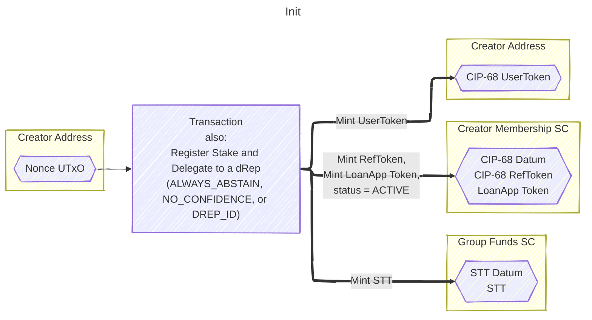

## Join

Join action is to join a tontine group. When someone joins a group, they will get a membership token. The `Policy ID` of that token serves as the Member ID. The membership is bound to that token, so the token holder can easily transfer it whenever there's a need.


The Group ID is manually filled in the mock off-chain app, but it should be automatically filled in the real prod app through some form of group selector.

> [!NOTE]
> Group ID is the Policy ID of the minted STT

- Who is this action intended for? Member
- When should it be executed? After Init
- 3 tokens will be minted,
  - Member loan-app token goes to Member Membership Address (script)
  - Member ref-token goes to Member Membership Address (same UTxO as the loan-app token)
  - Member user-token goes to Member Wallet Address

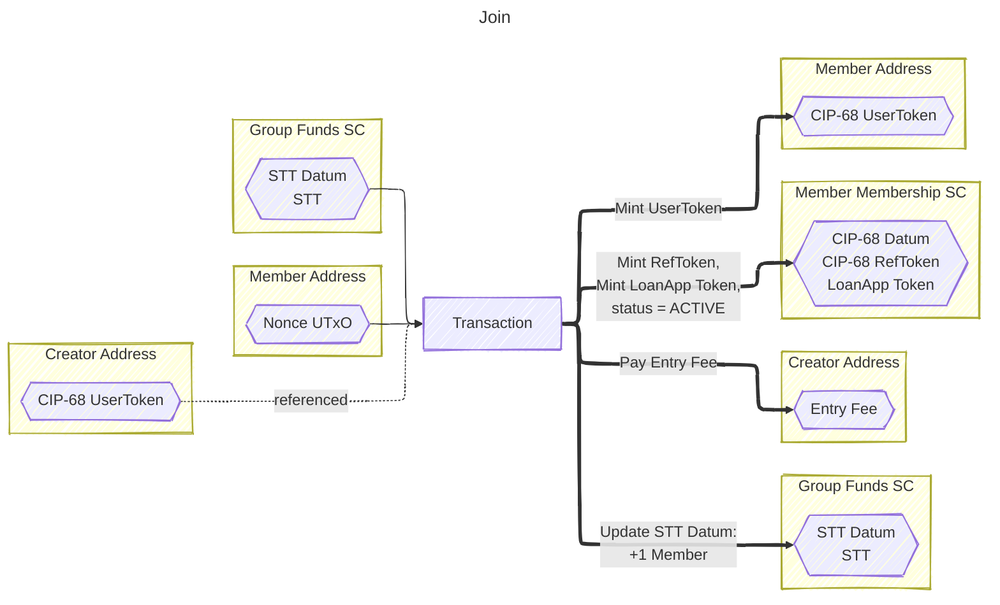

## Leave

Leave action is to leave a tontine group. So in case someone [joined](#join) a group, but the creator doesn't [start](#start) the tontine group, after some time, the member may leave the group. The membership and loan-app tokens will be burned (must be burned).


The Group ID and Member ID are manually filled in the mock off-chain app, but they should be automatically filled in the real prod app through some form of token selector.

> [!NOTE]
> Member ID is the Policy ID of the user token

- Who is this action intended for? Member
- When should it be executed? After Join or after group unlock (see: [withdraw](#withdraw))
- 3 tokens will be burned,
  - Member loan-app token burned (the member must NOT have a loan application)
  - Member ref-token burned (same UTxO as the loan-app token)
  - Member user-token burned

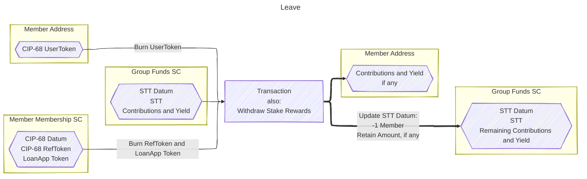

> [!NOTE]
> A leaving member should receive their share as `member_contributions_and_yield_share`:
>
> ```
> member_contributions_and_yield_share = contribution_amount + stake_rewards_share + loan_interest_share
> ```
>
> Where,
>
> - `contribution_amount` = `Member.contribution_count` x `ScriptParams.contribution_amount_per_round`
> - `stake_rewards_share` = `total_stake_rewards` / `participant_count`
> - `loan_interest_share` = `SttDatum.loan_interest` / `participant_count`
>
> Unless, the available amount is below that (caused by a large borrow amount from some running loans).
> In this case, the member would receive `distributed_member_share`:
>
> ```
> distributed_member_share = available_funds
> ```
>
> Where,
>
> - `available_funds` = `total_members_contributions` + `total_stake_rewards` + `SttDatum.loan_interest` + `SttDatum.retained_amount` - `SttDatum.borrowed_amount`
>
> And then `retained_amount` will be calculated as:
>
> ```
> retained_amount = member_contributions_and_yield_share - distributed_member_share
> ```
>
> This is to prevent the available amount calculation to fall below zero.
>
> In simple terms, a leaving member would receive either `member_contributions_and_yield_share` or `available_funds`,
> whichever is lesser.

## Start

Start action is to start a tontine group. It will set the group unlock date. This action will also update the group state to RUNNING. After that, no more people can can [join](#join) or [leave](#leave) the group until it unlocks.

> [!NOTE]
> This action can only be executed by the corresponding creator (those who are holding the particular tontine group creator token)


The Group ID and Creator ID are manually filled in the mock off-chain app, but they should be automatically filled in the real prod app through some form of token selector.

> [!NOTE]
> Creator ID is the Policy ID of the user token

- Who is this action intended for? Creator
- When should it be executed? After reaching the maximum number of participants
- STT UTxO is resent with updated datum (`is_running` = TRUE and SET `unlock_date`)
- Creator user-token is used to authorize the action

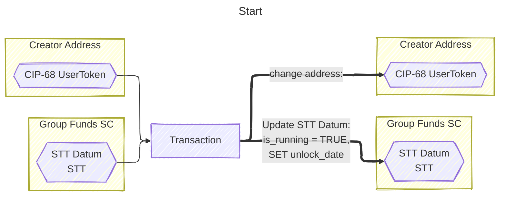

> [!NOTE]
> The unlock date is set to the number of rounds (Lock Period) times the number of days per round after Transaction's validity range's upper bound:
>
> ```
> unlock_date = Transaction.validity_range.upper_bound + ScriptParams.lock_period x ScriptParams.days_per_round
> ```

## Contribute

Contribute action is to contribute to a tontine group. Ideally, every round (typically every month) all group participants (creator and members) should contribute. Otherwise, they'd be ineligible to apply for a loan during the group lending phase.

If someone contributed less than the number of rounds (Lock Period), then they'd be unable to apply for a loan. But they're still eligible to vote and liquidate loans.

Contributing more than necesarry (> Lock Period) is allowed. It will increase the Voting Power. But beyond that, there's no other benefit as it won't increase any yield.


We can batch the [Contribute](#contribute) actions such that we execute a single action to contribute for multiple participants. The `total contribution amount` is automatically calculated as `the sum of Contributions Count` x `Contribution Amount per Round`.

> [!NOTE]
> Contributor IDs are the Policy IDs of the user tokens

> [!TIP]
> Total Contribution Amount = The Sum of Contributions Count x Contribution Amount per Round

Input example on the mock off-chain UI:

```
Group ID: 123456789a123456789b123456789c123456789d123456789e123456

Contribution(s):
a23456789a123456789b123456789c123456789d123456789e123456,1
b23456789a123456789b123456789c123456789d123456789e123457,2
c23456789a123456789b123456789c123456789d123456789e123458,3
d23456789a123456789b123456789c123456789d123456789e123459,4
```

- Who is this action intended for? Participant, or Source of Funds
- When should it be executed? After Start
- STT UTxO is resent with updated datum and contribution value
- This action is secure enough to be executed by anyone. We can batch this action execution in the future if needed

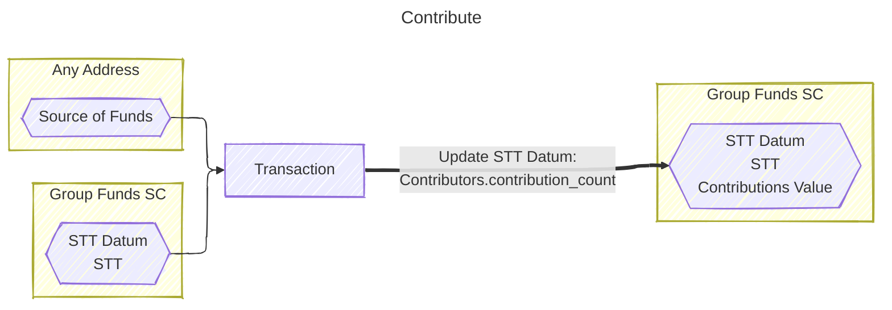

## Apply Loan

Participants who have contributed at least the same time as the number of rounds (`Participant.contribution_count` >= `ScriptParams.lock_period`) may apply for a loan.


Input example for the optional collateral and support documents:

```
Collateral:
,,50000000000
123456789a123456789b123456789c123456789d123456789e123456,abcdef,5

Support Document(s):
Business Plan,application/pdf,ipfs://QmV0CID...example
```

- `,,50000000000` means 50 thousand ADA
- `123456789a123456789b123456789c123456789d123456789e123456,abcdef,5` is 5 units of `abcdef` token with Policy ID `123456789a123456789b123456789c123456789d123456789e123456`

> [!NOTE]
> After applying for a loan, the membership status will be set to `Borrower`

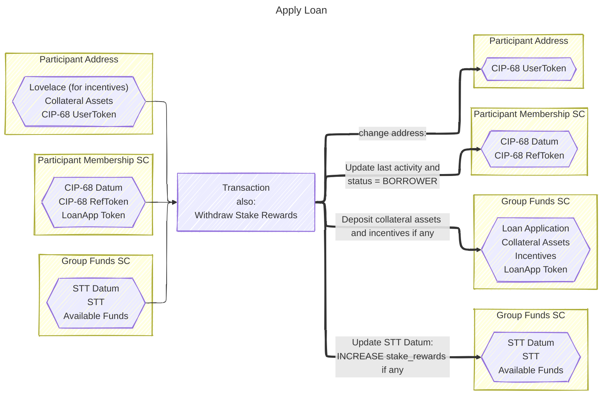

> [!NOTE]
> Loan Application's borrow amount cannot be greater than the available funds:
>
> ```
> Available Funds = Contributions + Total Stake Rewards after Stake Rewards Withdrawal + Loan Interests - Borrowed Amounts
> ```

### Query Loans

To view the list of loans, you can enter the **Group ID** and then submit it.


> [!NOTE]
> It's the **Group ID** (STT Policy ID) and NOT Tx Hash nor Participant ID

## Close Loan

If the loan is not approved, or the applicant wishes to cancel the loan (as long as [Borrow](#borrow-loan) action has not been performed)
then the loan may be closed.


> [!NOTE]
> After closing the loan, the membership status will be set back to `Active`

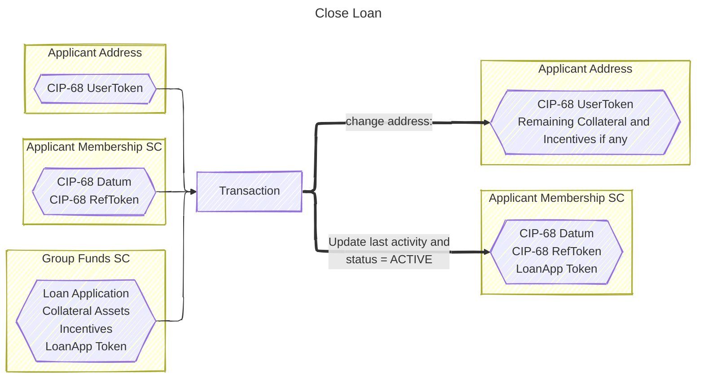

## Vote Loan

Non-applicant, even those who can't apply for a loan or haven't contributed anything, may vote on a loan application.
The voting power is the same value as the contribution count.


A voter may vote Yes or No. A loan applicant may provide some (optional) incentive to vote Yes, while voting No will not get any incentive.
Meaning a voter who votes Yes, the transaction fee might be covered by the incentive. While voters who vote No will pay for the transaction fees themselves.

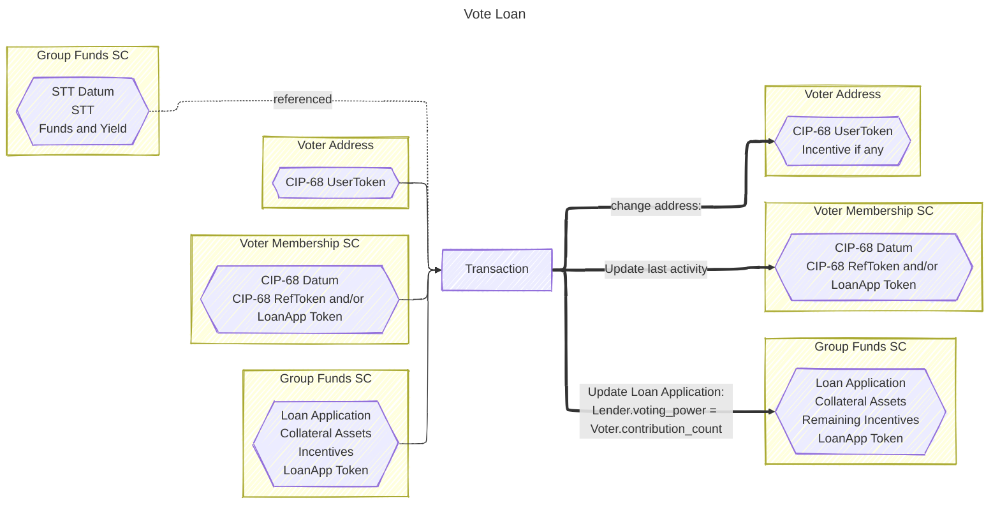

## Borrow Loan

If a loan is approved (Yes voting power > No voting power) then the applicant may perform Borrow action to withdraw the funds from the pool.


> [!WARNING]
> When the available funds fall below the `borrow_amount` as specified in the Loan Application,
> it is recommended to Close the loan even if it's approved. Because by continue performing Borrow action,
> the ditributed funds will be less than desired amount (it is whatever amount available left in the pool)
> while the borrower then must pay for the full interest as if the full amount was taken.

> [!NOTE]
> Borrowers who haven't repaid the loans after the repayment deadline will implicitly have their membership status as `Inactive`.
>
> The group creator may end the group if all members have left or are inactive.

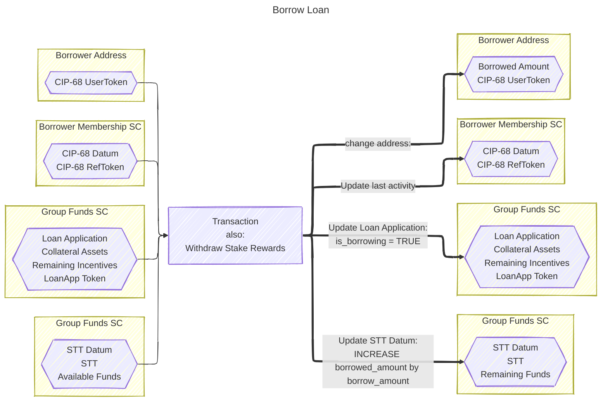

## Repay Loan

There are 2 possible interest rates applied when repaying for a loan. If the loan is repaid before the repayment deadline (as specified in the Loan Application)
then the normal interest rate will be used. But if the loan is repaid after the repayment deadline, then the late repayment interest rate will be used.


> [!NOTE]
> Unlike unforgiving protocols where loans are automatically liquidated upon deadline,
> here the borrower may negotiate with the lenders to pay after the deadline with a different interest rate.
>
> The lenders have the right to liquidate **their share** of collateral (if any)
> at any time after the deadline.
>
> The negotiation happens off-chain via group chat, so it's not binding to any on-chain rule.

> [!NOTE]
> After repaying the loan, the membership status will be set back to `Active`

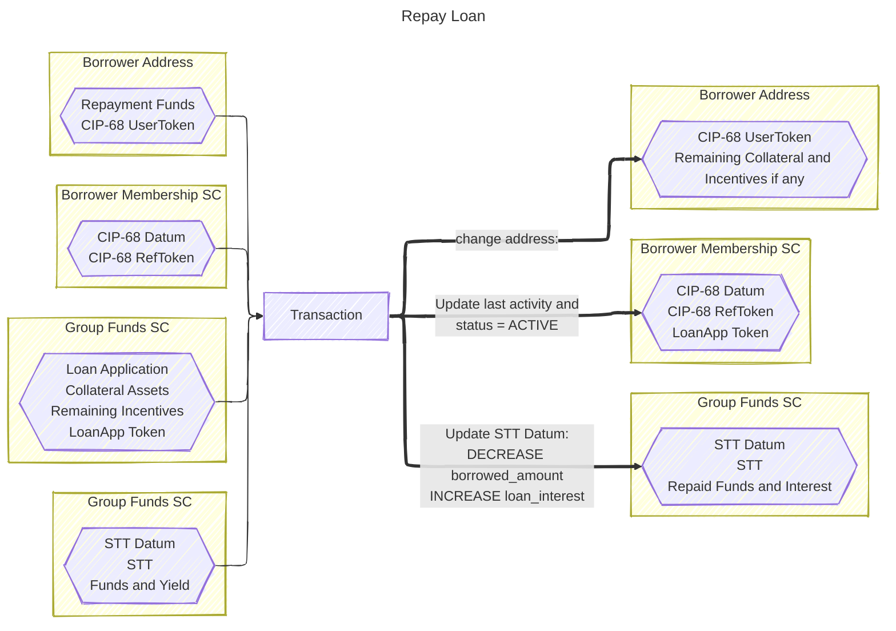

## Liquidate Loan

If a loan has passed its repayment deadline, lenders may perform this action to get **their share** of collateral.


> [!NOTE]
> Performing this action will NOT close the loan. It will only distribute some collateral (if any)
> to the lender performing this action. Each lender must perform this action individually.
>
> This is to accomodate flexibility, where some lenders may want to liquidate the loan
> while others are willing to wait for the late repayment.

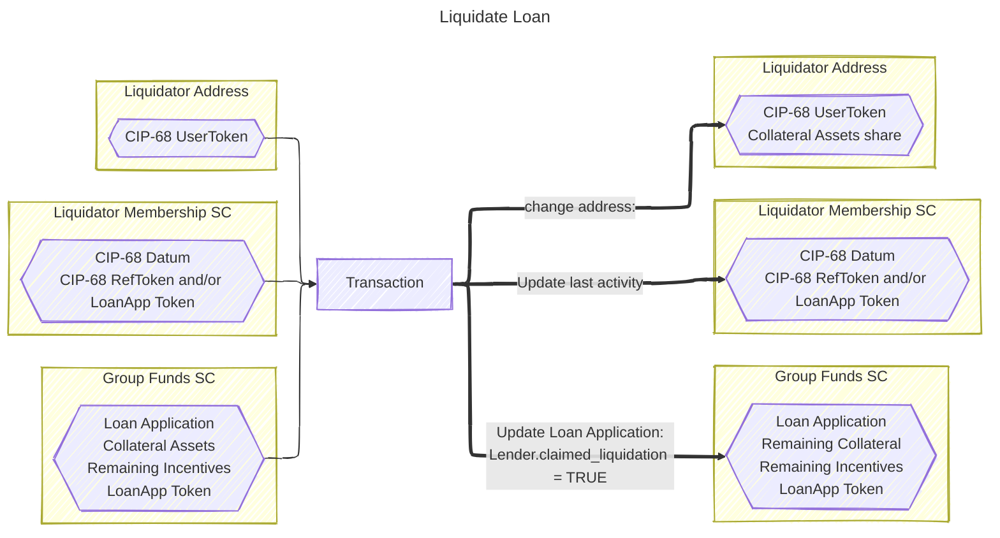

## Kick

Kick action is for the creator to kick inactive members. An inactive member is defined as:

```
member_last_activity < current_time - member_may_be_kicked_if_no_loan_activiy_after
```

Where,

- `member_last_activity` is `Member.last_loan_activity_time` OR `SttDatum.unlock_date` (if the member has not performed any loan activity)
- `current_time` is taken from `Transaction.validity_range.lower_bound` (must be set from the off-chain when submitting the transaction)
- `member_may_be_kicked_if_no_loan_activiy_after` is `ScriptParams.member_may_leave_if_not_started_after` + (`ScriptParams.lock_period` x `ScriptParams.days_per_round`)


There should be checkboxes and a button on the list of group participants to execute this action on the real prod app, instead of manually inputting the Group ID and the list of Members like this mock off-chain app.

> [!WARNING]
> This action cannot be performed if there's an active or invalid member amongst the list

- Who is this action intended for? Creator
- When should it be executed? Before the creator executes the end group action
- Member CIP-68
  - update `status` to INACTIVE

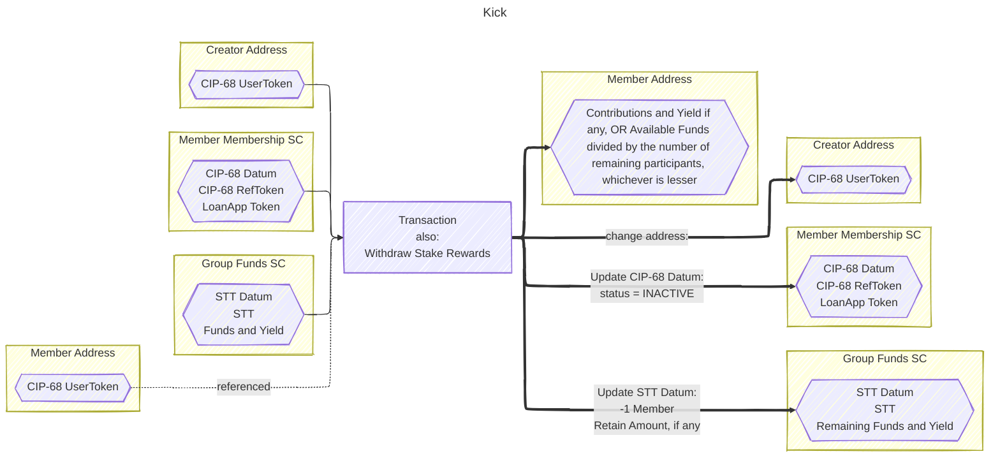

> [!NOTE]
> A kicked member should receive their share as `member_contributions_and_yield_share`:
>
> ```
> member_contributions_and_yield_share = contribution_amount + stake_rewards_share + loan_interest_share
> ```
>
> Where,
>
> - `contribution_amount` = `Member.contribution_count` x `ScriptParams.contribution_amount_per_round`
> - `stake_rewards_share` = `total_stake_rewards` / `participant_count`
> - `loan_interest_share` = `SttDatum.loan_interest` / `participant_count`
>
> Unless, the available amount is below that (caused by a large borrow amount from some running loans).
> In this case, the member would receive `distributed_member_share`:
>
> ```
> distributed_member_share = available_funds_share
> ```
>
> Where,
>
> - `available_funds_share` = (`total_members_contributions` + `total_stake_rewards` + `SttDatum.loan_interest` + `SttDatum.retained_amount` - `SttDatum.borrowed_amount`) / `participant_count`
>
> And then `retained_amount` will be calculated as:
>
> ```
> retained_amount = total_member_contributions_and_yield_share - total_distributed_member_share
> ```
>
> Where,
>
> - `total_member_contributions_and_yield_share` is the sum of values that should've been distributed
> - `total_distributed_member_share` is the sum of all values actually distributed
>
> In simple terms, a kicked member would receive either `member_contributions_and_yield_share` or `available_funds_share`,
> whichever is lesser.

## End

End action is to cancel or to end a tontine group. If this action is performed after the group has unlocked, then it can only be performed if all members have left or all remaining members are inactive (their loan applications have passed the repayment deadline).


There should be a button on the user dashboard to execute this action on the real prod app, instead of manually inputting the Group and Creator ID like this mock off-chain app.

> [!WARNING]
> This action cannot be performed if there's an active member or an active non-creator loan

- Who is this action intended for? Creator
- When should it be executed? After Init, and if it's an inactive group (no member, or member loans are all unborrowed or unpaid past their repayment deadline)
- STT, Creator CIP-68 token pair and Member user-token in in-out indices,
  - STT is burned
  - Creator loan-app token is burned
  - Creator ref-token is burned
  - Creator user-token is burned and used to authorize the action
  - Member user-token(s) are referenced to deliver some refundables

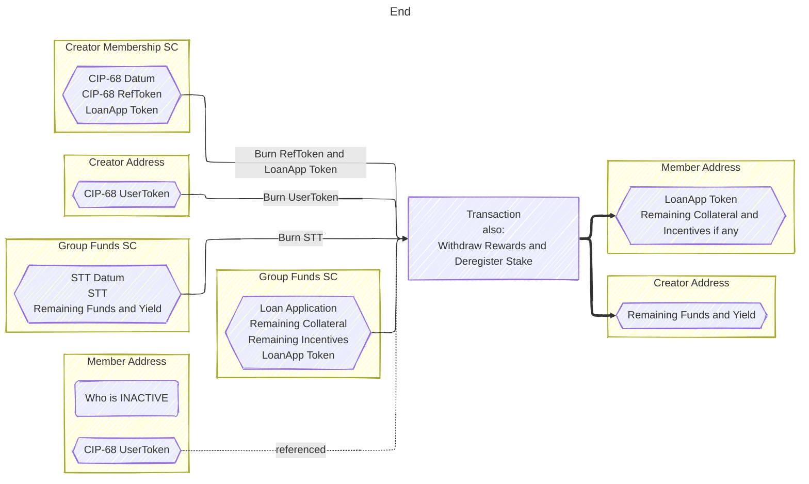

## Withdraw

Withdraw action is for [kicked](#kick) members to reclaim their locked ADA by undeploying scripts deployed when joining the group.


This action is relevant when the member is **KICKED** or **INACTIVE** (unpaid or unborrowed loan past repayment deadline).
Regardless, there should be a notification system notifying every member when the group is [ended](#end).

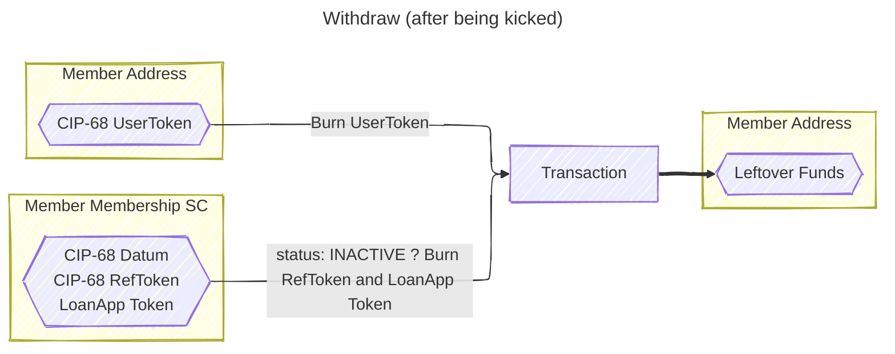

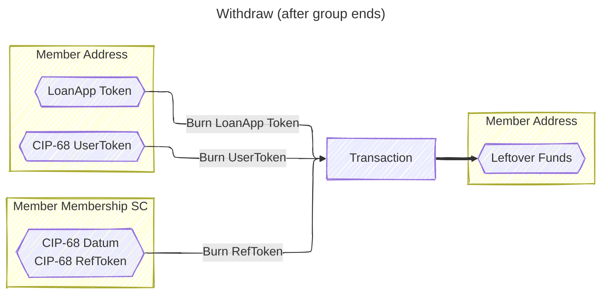

> [!NOTE]
> When the `LoanApp Token` is located in the same address as the `CIP-68 UserToken` address,
> it implicitly means that the group has been [ended](#end) (because during End Action,
> all inactive LoanApp Tokens are sent to their coresponding member addresses).
>
> Otherwise, if the `CIP-68` status is **INACTIVE**, it means that the member has been [kicked](#kick)
> by the creator. The group creator can only kick the member if, for all members:
>
> ```
> current_time >= member_last_activity + member_may_be_kicked_if_no_loan_activiy_after
> ```
>
> Where,
>
> - `current_time` is taken from `Transaction.validity_range.lower_bound` (must be set from the off-chain when submitting the transaction)
> - `member_last_activity` is `Member.last_loan_activity_time` OR `SttDatum.unlock_date` (if the member has not performed any loan activity)
> - `member_may_be_kicked_if_no_loan_activiy_after` is `ScriptParams.member_may_leave_if_not_started_after` + (`ScriptParams.lock_period` x `ScriptParams.days_per_round`)
