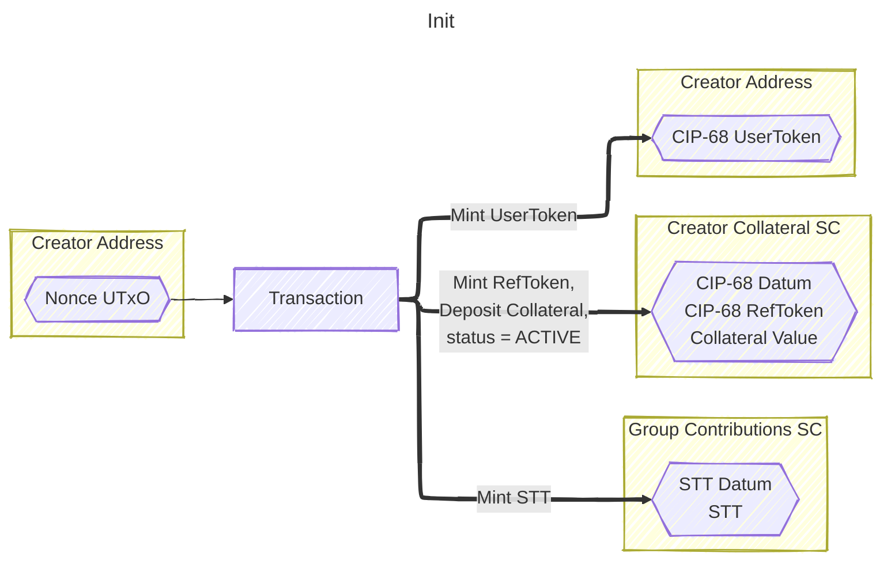
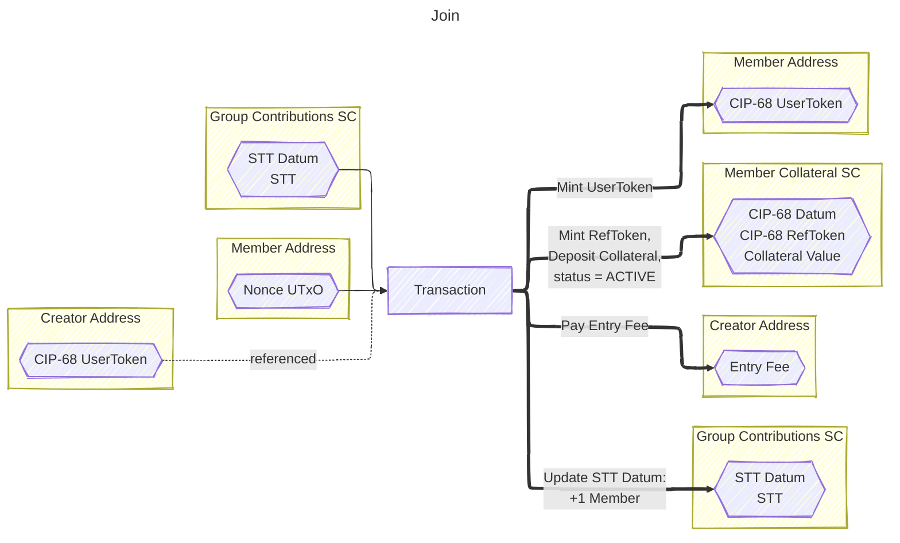
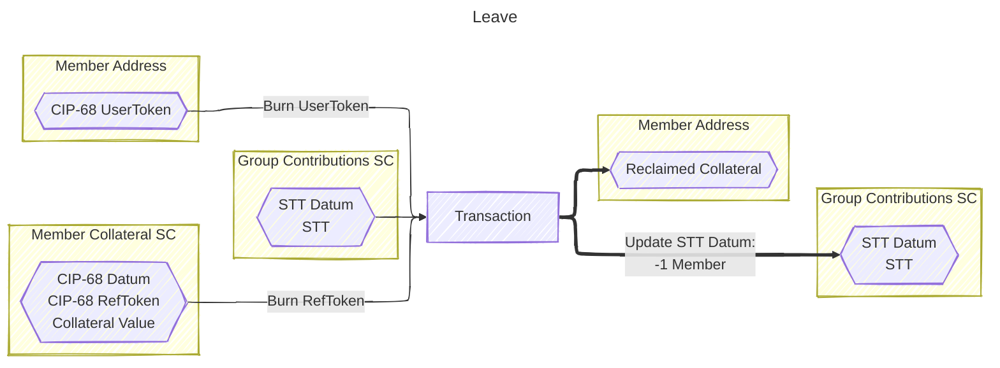
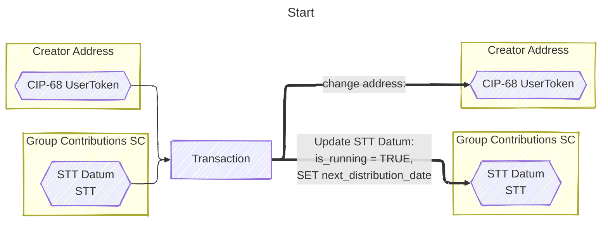
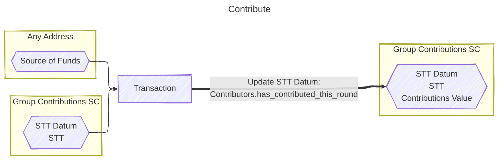
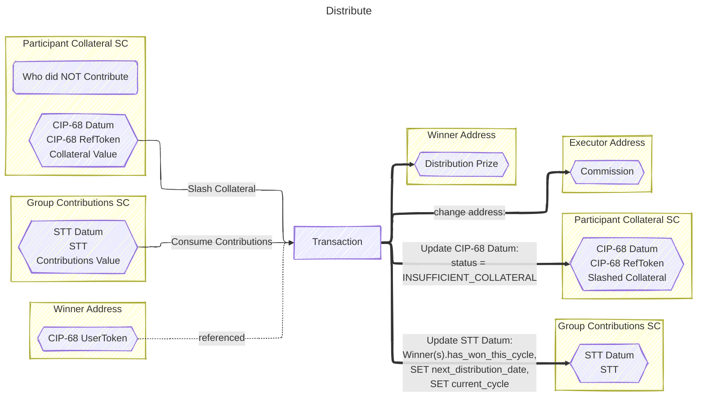
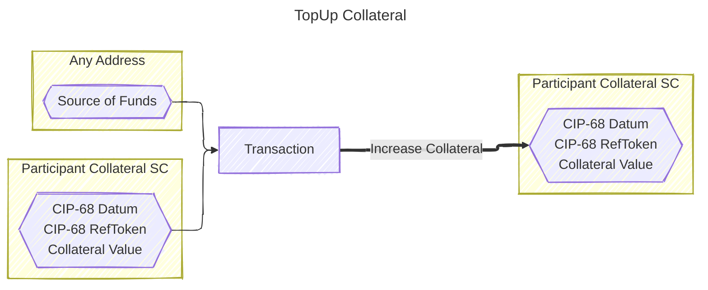
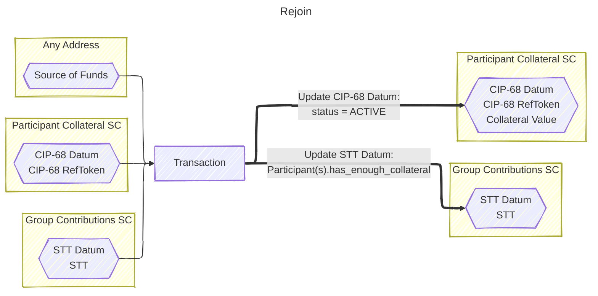
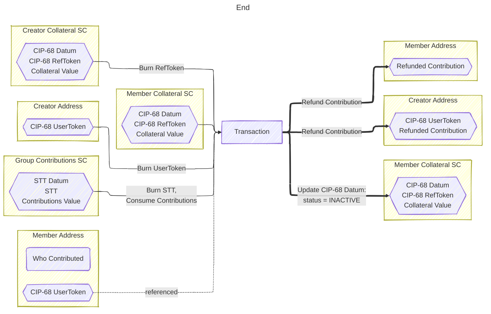
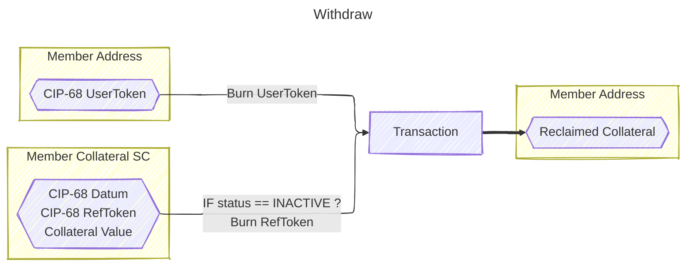

# Akyba: ROSCA v1

There are 10 actions:

- Init
- Join
- Leave
- Start
- Contribute
- Distribute
- Top-up Collateral
- Rejoin
- End
- Withdraw

## Init

Init action is to initialize a tontine group. Each group will have a unique address. The group state is located as a datum (STT Datum) in one of the UTXOs, authenticated by the existence of an STT (State Thread Token) locked in the same UTxO.

This action can be performed by anyone who wants to be a tontine group owner, even if they're currently a member of another group(s).

> [!NOTE]
> The group may be [started](#start) before reaching its full capacity

The parameters are:
| Field | Description |
| :---: | ----------- |
| Group Name | The name of the group |
| Group Image URL | The URL of the group image which will be used as the group membership token image |
| Group Description | Optional short description of the group |
| Max Number of Participants | The maximum capacity of the group |
| Number of Winners per Round | The number of winners per round. Typically, it's 1 person, but it can be more if there are a lot of participants |
| Contribution Amount per Round | The amount each participant must contribute every round |
| Minimum Collateral | The initial collateral deposit amount. Both the creator and members must deposit the initial collateral when initializing/joining a group. The collateral will be slashed if a participant misses a contribution during the distribution phase. If the available collateral stays below the minimum, then during the next distribution phase, the participant will be flagged with INSUFFICIENT_COLLATERAL. In that case, the participant must execute the rejoin action to undo the flag |
| Entry Fee | Optional fee amount for someone to join the group; will be distributed to the group creator |
| Member May Leave If Not Started After | The delay time before someone can leave after joining the group |
| Distribution Comission | Optional commission for someone to execute the distribute action |
| Days per Round | The number of days per round. Typically, it's 30 days, but it can be shorter if needed (e.g., 14 days for bi-weekly distribution) |

> [!IMPORTANT]  
> You must sign all 4 pop-ups. The first one is to initialize the group, the rest are to deploy scripts uniquely associated with your group and membership.

> [!WARNING]
> Once submitted, the parameter values are immutable. There's no editting any value, this will give confidence for people to join the group knowing that the parameter values cannot be manipulated by the group creator, or the platform, after they join

> [!TIP]
> To "edit" the group parameter values, the group must be re-created ([End](#end) the current one and then [Init](#init) a new one)

- Who is this action intended for? Creator
- When should it be executed? 1st action
- 3 tokens will be minted,
  - STT goes to Group Contributions Address (script)
  - Creator ref-token goes to Creator Collateral Address (script)
  - Creator user-token goes to Creator Wallet Address

## Join

Join action is to join a tontine group. When someone joins a group, they will get a membership token. The `Policy ID` of that token serves as the Member ID. The membership is bound to that token, so the token holder can easily transfer it whenever there's a need.

The Group ID is manually filled in the mock off-chain app, but it should be automatically filled in the real prod app through some form of group selector.

> [!IMPORTANT]  
> You must sign all 2 pop-ups

> [!NOTE]
> Group ID is the Policy ID of the minted STT

- Who is this action intended for? Member
- When should it be executed? After Init
- 2 tokens will be minted,
  - Member ref-token goes to Member Collateral Address (script)
  - Member user-token goes to Member Wallet Address

## Leave

Leave action is to leave a tontine group. So in case someone [joined](#join) a group, but the creator doesn't [start](#start) the tontine group, after some time, the member may leave the group. The collateral will be refunded, and the membership token will be burned.

The Group ID and Member ID are manually filled in the mock off-chain app, but they should be automatically filled in the real prod app through some form of token selector.

> [!NOTE]
> Member ID is the Policy ID of the user token

- Who is this action intended for? Member
- When should it be executed? After Join
- 2 tokens will be burned,
  - Member ref-token burned, initial deposit value refunded
  - Member user-token burned

## Start

Start action is to start a tontine group. It will kickstart the next distribution date. This action will also update the group state to RUNNING. After that, no more people can can [join](#join) or [leave](#leave) the group until it [ends](#end).

> [!NOTE]
> This action can only be executed by the corresponding creator (those who are holding the particular tontine group creator token)

The Group ID and Creator ID are manually filled in the mock off-chain app, but they should be automatically filled in the real prod app through some form of token selector.

> [!NOTE]
> Creator ID is the Policy ID of the user token

- Who is this action intended for? Creator
- When should it be executed? After reaching the maximum number of participants
- STT UTxO is resent with updated datum (`is_running` = TRUE and SET `next_distribution_date`)
- Creator user-token is used to authorize the action

## Contribute

Contribute action is to contribute to a tontine group. Ideally, every round (typically every month) all group participants (creator and members) should contribute. Otherwise, they'd be ineligible to be nominated as a potential winner during the next distribution phase.

If someone did not contribute, then their collateral will be slashed during the [distribution](#distribute) phase. The slashing amount is equal to the `Contribution Amount per Round` (see: Group Parameters).

If they don't have enough collateral to be slashed, then they'll be flagged as inactive members. As an inactive member, they're ineligible to be nominated as a potential winner during the subsequent rounds until they perform the [rejoin](#rejoin) action.

> [!WARNING]
> For the flagged participants, contributing without rejoining will NOT reactivate the membership, because they must deposit the minimum collateral. [Topping-up collateral](#top-up-collateral) instead of rejoining, also will NOT reactivate the membership, because that action does NOT update the STT Datum

We can batch the [Contribute](#contribute) actions such that we execute a single action to contribute for multiple participants. The `total contribution amount` is automatically calculated as `the number of Contributor IDs` x `Contribution Amount per Round`.

> [!NOTE]
> Contributor IDs are the Policy IDs of the user tokens

> [!TIP]
> Total Contribution Amount = The Number of Contributor IDs x Contribution Amount per Round

- Who is this action intended for? Participant, or Source of Funds
- When should it be executed? After Start, and also After every Distribution phase.
- STT UTxO is resent with updated datum and contribution value
- This action is secure enough to be executed by anyone. We can batch this action execution in the future if needed

## Distribute

Distribute action is to distribute the prize. This action should be executed periodically based on the `Days per Round` parameter value (see: Group Parameters).

This action is secure enough to be executed by anyone. There's some commission (depending on the `Distribution Commission` percentage value) as an incentive for 3rd parties to execute this action.

> [!WARNING]
> If there's no eligible participant to be nominated as a winner(s), then this action cannot be executed. We can consider the particular tontine group as inactive

> [!NOTE]
> This action is intended to be executed by some automated systems, or 3rd parties who would like to execute the action

- Who is this action intended for? Executor (anybody)
- When should it be executed? After the next distribution date
- STT, Participant(s) ref-token and Winner(s) user-token in ref-in,
  - STT UTxO is resent with updated datum and deducted value (prize)
  - Participant collateral are slashed if required (ref-token UTxO)
  - Winner user-token(s) are referenced to deliver the prize
  - This action is secure enough to be executed by anyone. In fact, there's some commission for the tx executor
- Each participant who did not contribute this round is flagged by updating the CIP-68 status to INSUFFICIENT_COLLATERAL if their collateral is not enough to be slashed

## Top-up Collateral

Top-up Collateral action is to increase a participant's collateral. This action is secure enough that anyone is allowed to execute it. The on-chain script validates the output amount and metadatum.

> [!TIP]
> There's no financial benefit for anyone other than the collateral owner to perform this action

The Group ID and Participant ID are manually filled in the mock off-chain app, but they should be automatically filled in the real prod app through some form of token selector. In the final dApp, the user would only specify the top-up amount, or maybe there's a button with a fixed amount instead.

> [!NOTE]
> Participant ID is the Policy ID of the user token

> [!WARNING]
> Top-up Amount must NOT be negative!

- Who is this action intended for? Participant, or Source of Funds
- When should it be executed? After collateral slashing, but before the next distribution phase.
- Participant collateral UTxO(s) are resent alongside the ref-token
- This action is secure enough to be executed by anyone. There's no financial benefit for non-participants to execute this

## Rejoin

Rejoin action is to rejoin a tontine group after being marked as not having enough collateral due to being slashed during a [distribution](#distribute) phase.

This action is like a blend of [Contribute](#contribute) and [Top-up Collateral](#top-up-collateral).

This action is somewhat designed so it can be batched, in case it's needed to scale in the future.

> [!WARNING]
> The output amounts of every participant must be greater than the Minimum Collateral

- Who is this action intended for? Participant, or Source of Funds
- When should it be executed? After collateral slashing and the participant is marked as not having enough collateral
- STT and Participant ref-token(s),
  - STT UTxO is resent with updated datum (`Participant.has_enough_collateral` = TRUE)
  - Participant collateral UTXOs are resent alongside the ref-token
  - This action is secure enough to be executed by anyone. We can batch this action execution in the future if needed
- Each member's collateral ref-token UTxO is activated by updating the CIP-68 status to ACTIVE

## End

End action is to cancel or to end a tontine group. If this action is performed after the group has been [started](#start), then any contributions will be refunded to the corresponding participants (identified by the location of the membership tokens). This action cannot be performed if the group creator has just won the previous round, unless, after the next distribution phase, nobody contributed (inactive group).

This action is like the opposite of [Start](#start). In the final dApp, there should be a button on the user dashboard to execute this action instead of manually inputting the Group and Creator ID like in the mock off-chain app.

> [!WARNING]
> This action cannot be performed if the group creator has just won the previous round, unless nobody contributed after the next distribution phase (inactive group)

- Who is this action intended for? Creator
- When should it be executed? After Init, or any time except when the creator has just won the previous round, unless it's an inactive group
- STT is burned
- Creator ref-token is burned
- Creator user-token is burned and used to authorize the action
- Member user-token(s) are referenced to deliver the refund
- Each member's collateral ref-token UTxO is deactivated by updating the CIP-68 status to INACTIVE

## Withdraw

Withdraw action is to withdraw any residual collateral after the group has [ended](#end).

This action is similar to [Leave](#leave) from the perspective of a group member.

In the final dApp, there should be a notification system notifying every member when the group is [ended](#end).
Right now, we don't have that yet because we don't store any user email.

- Who is this action intended for? Member
- When should it be executed? After End
- 2 tokens will be burned,
  - Member ref-token burned, collateral value refunded
  - Member user-token burned

